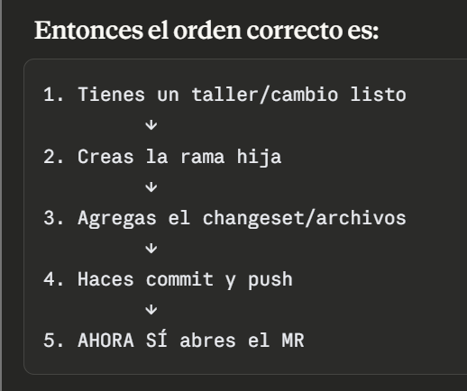
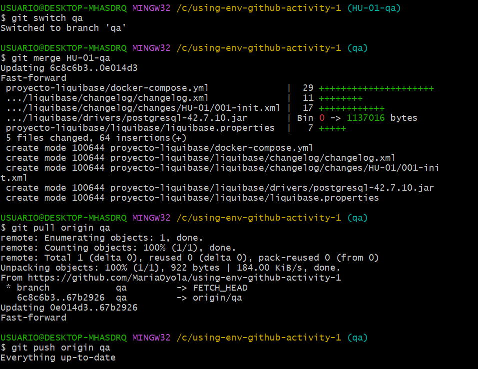
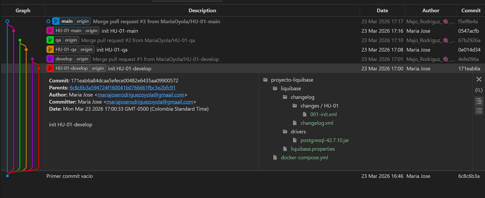
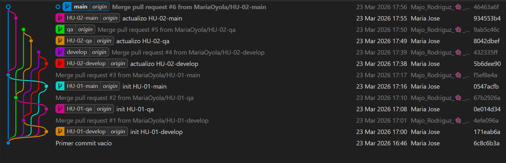
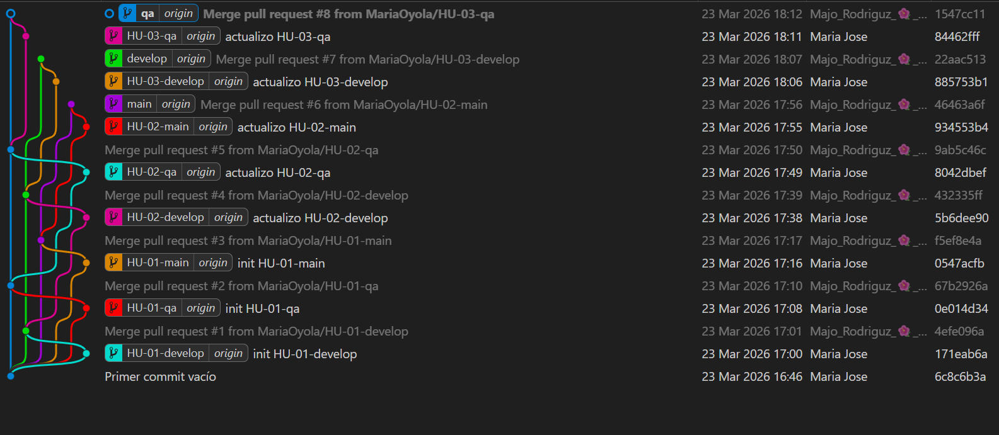

# Repositorio de la actividad 
https://github.com/MariaOyola/using-env-github-activity-1

## Rama padre = rama protegida, es el "ambiente oficial". Nadie escribe directamente ahí.

>- develop  → ambiente de desarrollo
>- qa       → ambiente de pruebas
>- main     → ambiente de producción

## Rama hija (HU) = rama temporal que tú creas para trabajar. Nace de su padre, hace el trabajo, y muere al mergearse.

>- HU-01-develop  → hija de develop
>- HU-01-qa       → hija de qa
>- HU-01-main     → hija de main

## MR (Merge Request) = es una solicitud formal que dices "oye, tengo cambios en mi rama hija, revísalos y únelos a la rama padre". Es el único puente permitido entre hija y padre.

- Cada vez que se mergea una rama por ejemplo HU-01-develop a develop, esa rama ya muere no se toca NUNCA JAMAS, y se crea HU-02-develop que es  la rama en la cual se hace la siguiente actualizacion, 

Comandos 

---------------------------------------------------
## Flujo en Git Graph

#### - Como se Visualiza el flujo con el primer HU-01 (primer historial de usuari)

- HU-02 (segundo historial de usuari)

- - HU-03 (tercer historial de usuari) develop, qa

