## base de datos Gestión de aerolínea + vuelos + clientes + ventas + pagos
-------------------------------------

### Modulos que contiene 

#### GEOGRAFÍA

Contiene las Ubicación geográfica + dinero

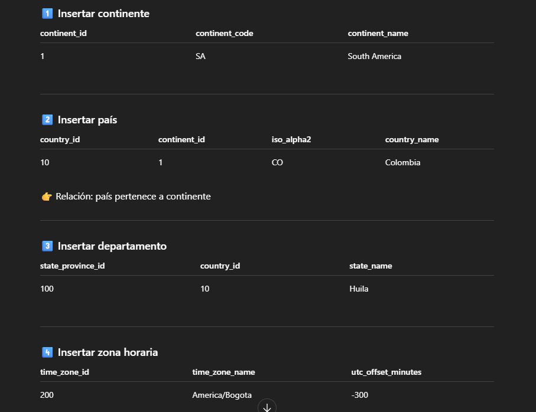
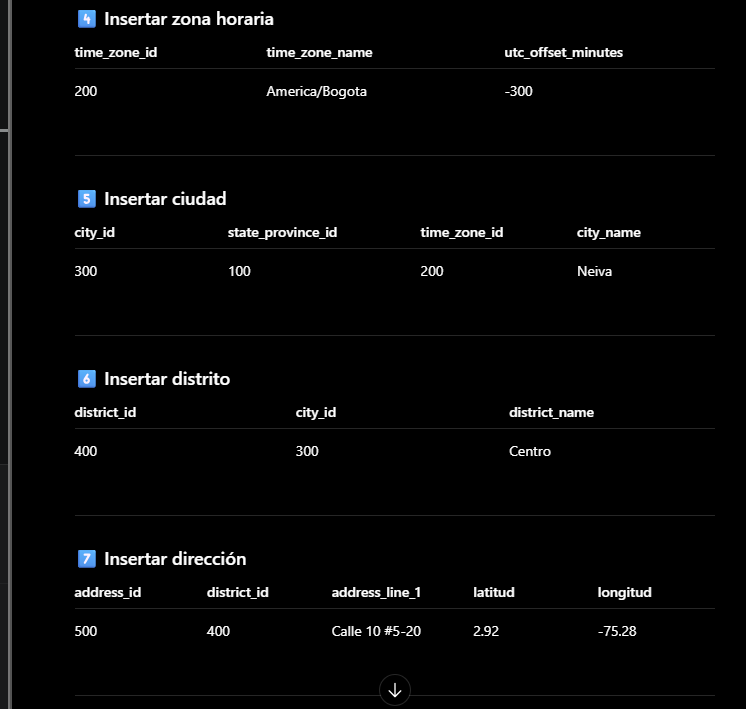
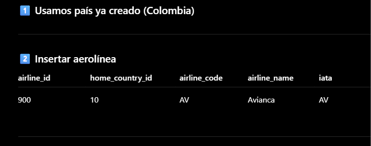

#### RELACIONES

> continente → country
✔️ Tipo: 1 a muchos

👉 Un continente tiene muchos países
👉 Un país pertenece a un solo continente

> country → state_province

✔️ Tipo: 1 a muchos

👉 Un país tiene muchos departamentos
👉 Un departamento pertenece a un solo país

> state_province → city

✔️ Tipo: 1 a muchos

👉 Un departamento tiene muchas ciudades
👉 Una ciudad pertenece a un solo departamento

> city → district

✔️ Tipo: 1 a muchos

👉 Una ciudad tiene muchos distritos
👉 Un distrito pertenece a una sola ciudad

> district → address

✔️ Tipo: 1 a muchos

👉 Un distrito tiene muchas direcciones
👉 Una dirección pertenece a un solo distrito

> time_zone → city

✔️ Tipo: 1 a muchos

👉 Una zona horaria puede tener muchas ciudades
👉 Una ciudad solo tiene una zona horaria

> country → airline

✔️ Tipo: 1 a muchos

👉 Un país puede tener muchas aerolíneas
👉 Una aerolínea pertenece a un solo país

_____________________________________

#### Personas 

Registrar una persona con documento y contacto

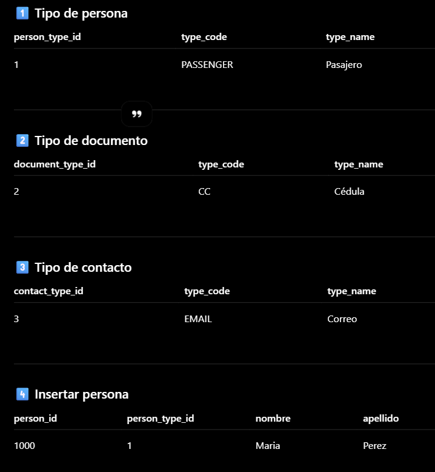
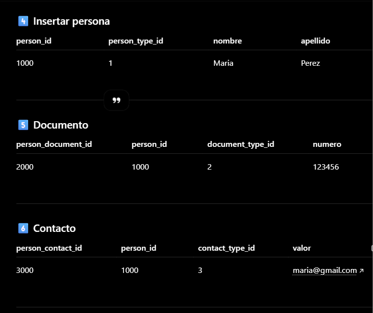

#### RELACIONES

> person_type → person

✔️ Tipo: 1 a muchos

👉 Un tipo de persona (ej: pasajero) puede ser muchas personas
👉 Una persona tiene un solo tipo ( que es pasajero)

> country → person

✔️ Tipo: 1 a muchos

👉 Un país puede tener muchas personas (nacionalidad)
👉 Una persona tiene un país

> person → person_document

✔️ Tipo: 1 a muchos

👉 Una persona puede tener varios documentos
👉 Un documento pertenece a una sola persona

> document_type → person_document

✔️ Tipo: 1 a muchos

👉 Un tipo de documento (CC, pasaporte) se usa en muchos registros
👉 Cada documento tiene un tipo

> country → person_document

✔️ Tipo: 1 a muchos

👉 Un país puede emitir muchos documentos
👉 Un documento pertenece a un país emisor

 > person → person_contact

✔️ Tipo: 1 a muchos

👉 Una persona puede tener muchos contactos
👉 Un contacto pertenece a una persona

> contact_type → person_contact

✔️ Tipo: 1 a muchos

👉 Un tipo de contacto (email, teléfono) puede repetirse
👉 Cada contacto tiene un tipo

___________________________________
#### SECURITY

Crear un usuario con rol y permisos

👉 Ejemplo:

- Persona: María Pérez
- Usuario: maria123
- Rol: ADMIN
- Permiso: CREAR_USUARIO

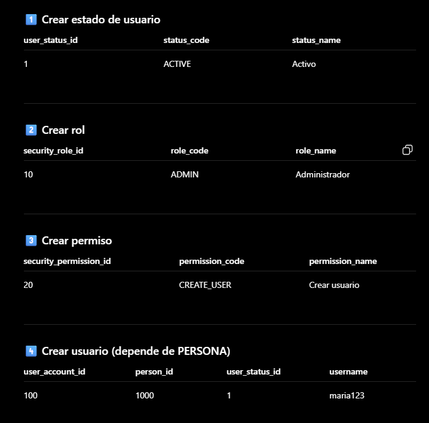
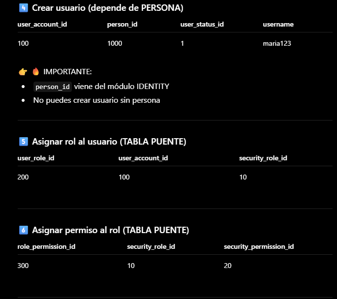

#### RELACIONES

> user_status → user_account

✔️ Un estado tiene muchos usuarios
✔️ Un usuario tiene un estado

> person → user_account

✔️ Una persona tiene un usuario
✔️ (casi 1:1 por UNIQUE)

> user_account → user_role
✔️ Un usuario puede tener varios roles

> security_role → user_role
✔️ Un rol puede estar en muchos usuarios

> security_role → role_permission
✔️ Un rol tiene muchos permisos

> security_permission → role_permission
✔️ Un permiso puede estar en muchos roles

### MUCHOS A MUCHOS (N:M) – LAS MÁS IMPORTANTES

> user_account ↔ security_role

👉 Se resuelve con:
✔️ user_role

> user_account → user_account

✔️ Tipo: 1 a muchos
👉 Ejemplo:
un usuario crea a otro usuario

____________________________________

#### CUSTOMER & LOYALTY

Un cliente se registra en un programa de fidelización, gana millas y obtiene beneficios

Ejemplo:

- Cliente: María Pérez
- Aerolínea: Avianca
- Programa: LifeMiles
- Nivel: Gold
- Gana 500 millas

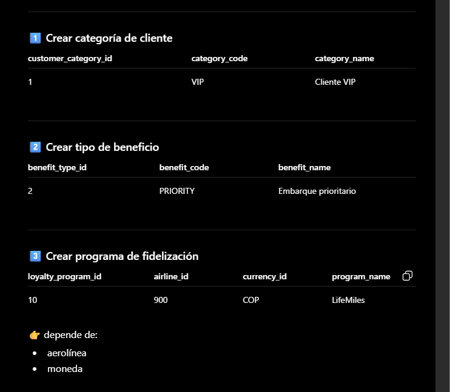

👉 depende de:
- aerolínea
- moneda

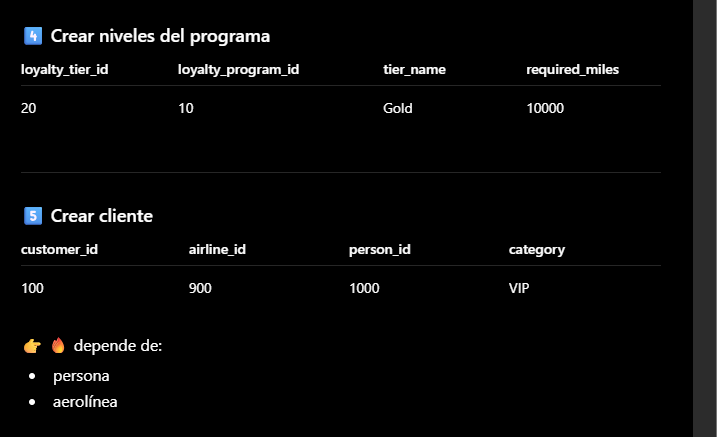

👉 depende de:
- persona
- aerolínea

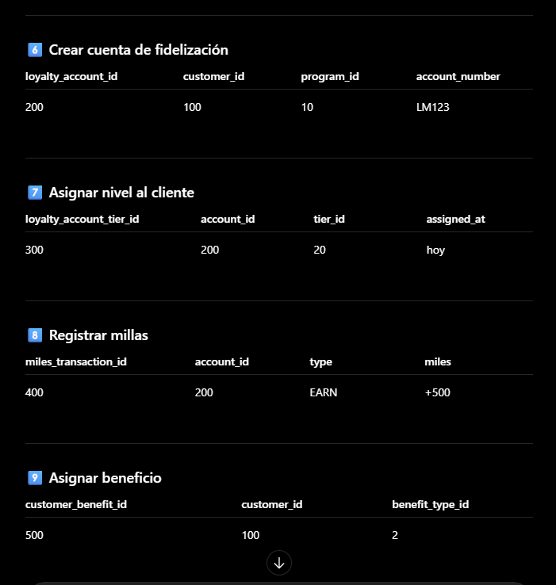

- es cliente ✔️
- tiene cuenta de fidelización ✔️
- tiene nivel Gold ✔️
- tiene millas ✔️
- tiene beneficios ✔️

#### RELACIONES

> airline → loyalty_program
✔️ Una aerolínea tiene muchos programas

> currency → loyalty_program
✔️ Un programa usa una moneda

> loyalty_program → loyalty_tier
✔️ Un programa tiene muchos niveles

> airline → customer
✔️ Una aerolínea tiene muchos clientes

> person → customer
✔️ Una persona puede ser cliente

> customer_category → customer
✔️ Una categoría tiene muchos clientes

> customer → loyalty_account
✔️ Un cliente puede tener varias cuentas

> loyalty_program → loyalty_account
✔️ Un programa tiene muchas cuentas

> loyalty_account → miles_transaction
✔️ Una cuenta tiene muchas transacciones

> loyalty_account → loyalty_account_tier
✔️ Una cuenta tiene historial de niveles

>loyalty_tier → loyalty_account_tier
✔️ Un nivel puede estar en muchas cuentas

> customer → customer_benefit
✔️ Un cliente puede tener muchos beneficios

> benefit_type → customer_benefit
✔️ Un tipo de beneficio se repite en muchos clientes

#### MUCHOS A MUCHOS (N:M)

> customer ↔ benefit_type

> loyalty_account ↔ loyalty_tier

-------------------------------------------------------------

#### AIRPORT + AIRCRAFT + FLIGHT

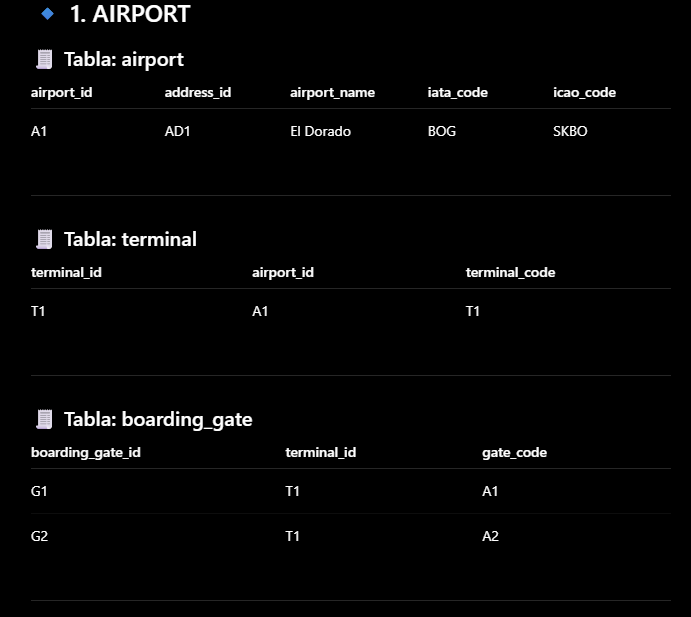
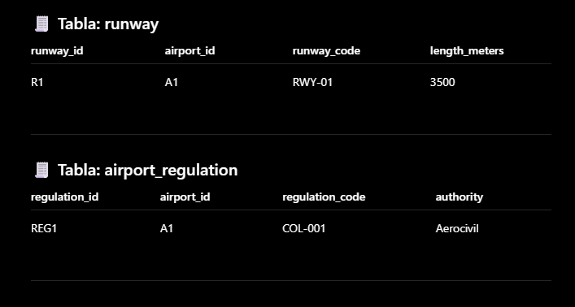
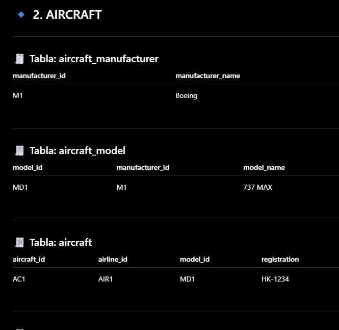
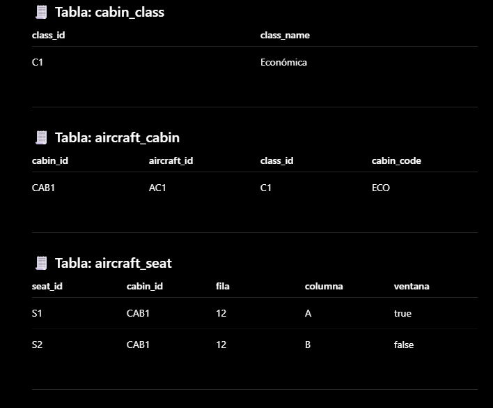
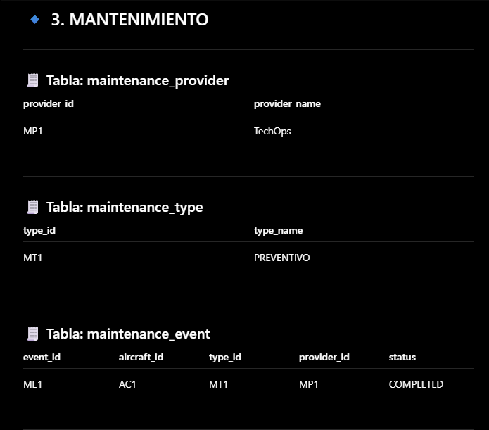
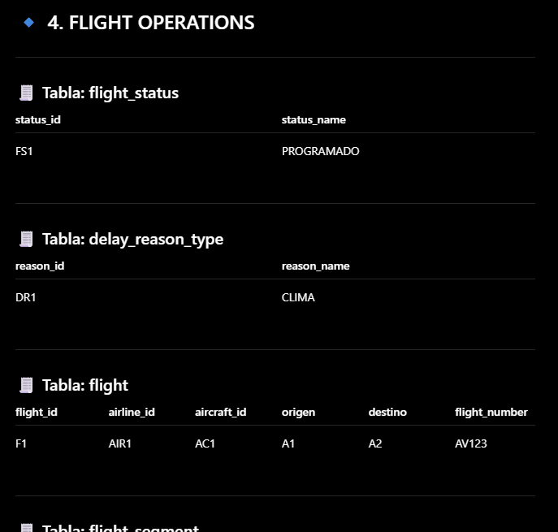
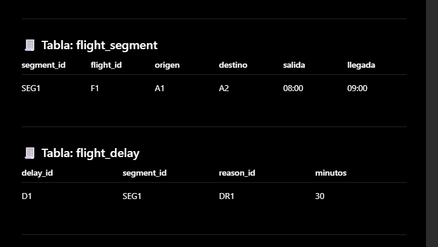

#### ESTADOS Y CONFIGURACIÓN

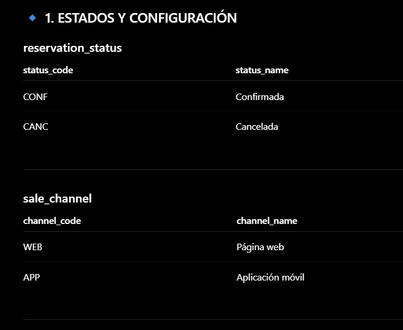
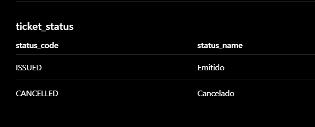

#### RESERVA
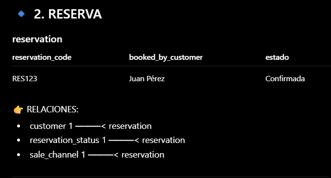

#### PASAJEROS
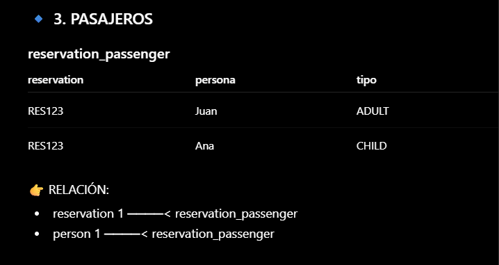

#### VENTA
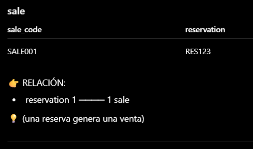

#### TARIFA

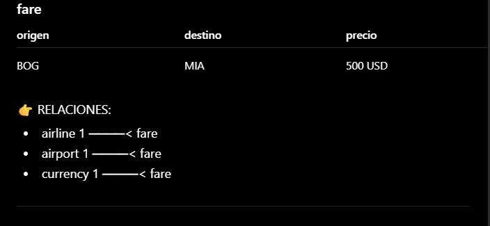

#### TICKETS 
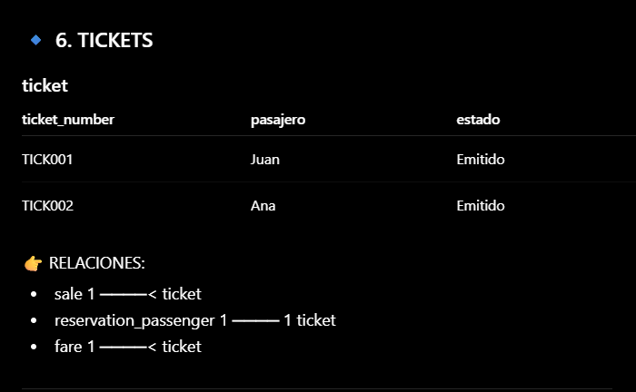

#### SEGMENTOS DEL TICKET
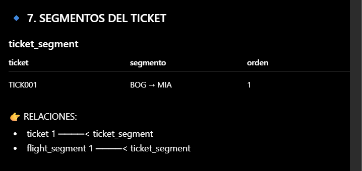

#### ASIGNACIÓN DE ASIENTO
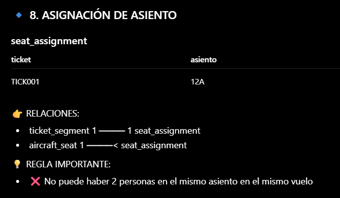

#### EQUIPAJE
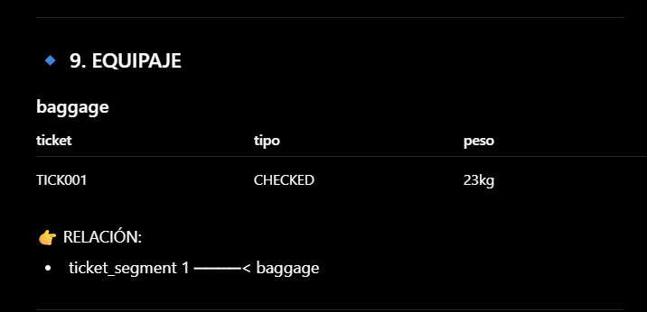

#### BOARDING (ABORDAJE)

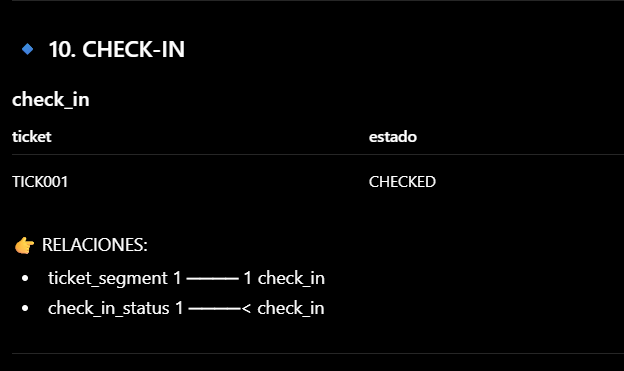

#### BOARDING PASS
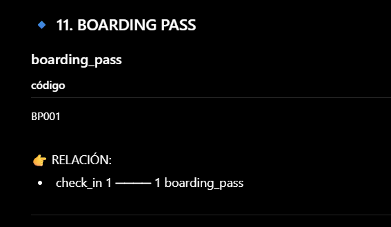

#### VALIDACIÓN
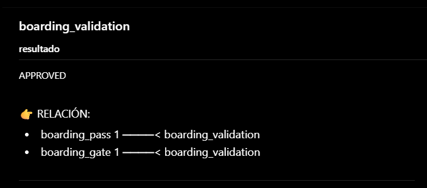

#### PAGO 
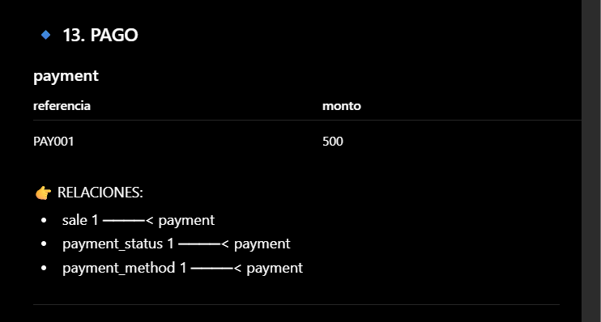

#### TRANSACCIÓN
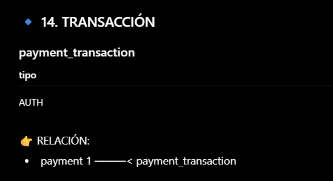

#### REEMBOLSO

#### FACTURA
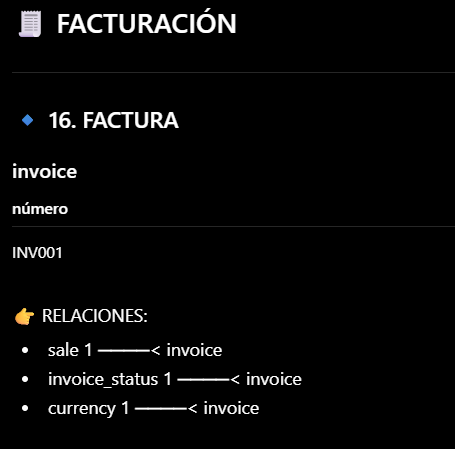

#### DETALLE DE FACTURA
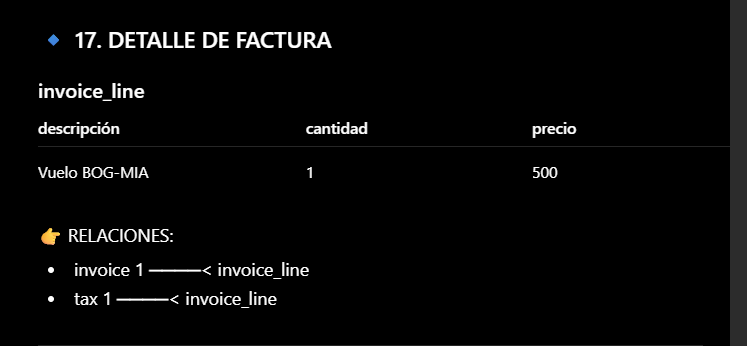

#### RELACIONES 

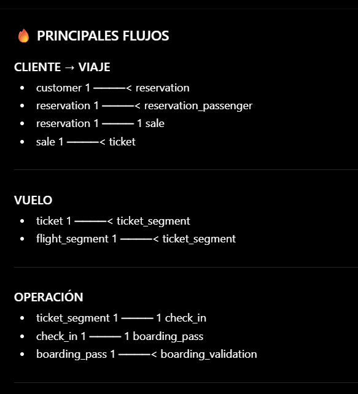
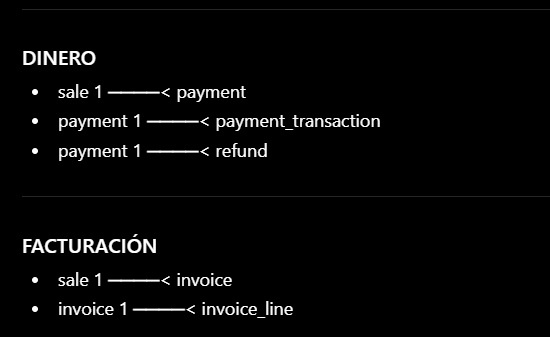