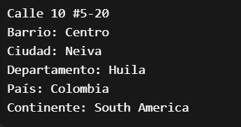

## base de datos Gestión de aerolínea + vuelos + clientes + ventas + pagos
-------------------------------------

### Modulos que contiene 

#### GEOGRAFÍA

Contiene las Ubicación geográfica + dinero

> continent (Continente) 

Se Guardan los continentes que se van a usar

| continent_id | continent_code | continent_name |
|-----------|-----------|-----------|
|  1 (uuid) | SA  | South America  |

-----------------------------------------------------

> country (País)

Un país pertenece a un continente.

<Relación>
UN Contienete  PUEDE  TENER MUCHOS Paises 1:N

| continent_id | iso_alpha2 | iso_alpha3 |country_name |
|-----------|-----------|----------- | -----------|
|  id_continent | CO |  COL  | Colombia  |

-------------------------------------------

> state_province (Departamento)
 
 Divide un país en estados o departamentos.

<Relación>
Un departamento pertenecee a un solo pais -- un pais tiene muchos departamentos 1:N

| country_id| state_name |
|-----------|-----------|
| id_colombia | Huila  | 

-------------------------------------------

> time_zone (Zona horaria)

Define la zona horaria

| time_zone_name | utc_offset_minutes |
|-----------|-----------|
| America/Bogota |  -300 | 

-----------------------------------------------------

> city (Ciudad)
Ciudad dentro de un departamento

<Relación>
una ciudad tiene un solo departamento pero un departamento tiene varias ciudades 1:N

una ciudad tiene un solo departamento pero un departamento tiene varias ciudades 1:N

| state_province_id |  time_zone_id |   city_name |
|-----------|-----------| -----------|
| id_huila|  id_timezone | Neiva |

- Resultado

Neiva está en: Huila, Zona Horario Bogota
_________________________________

> district (Barrio)

Subdivisión de la ciudad

<Relación>
un Barrio solo pertenece a una ciudad y la ciudad tiene muchos barrios 1:N. 

| city_id |  district_name |  
|-----------|-----------| 
| id_neiva|  centro | 

- Resultado

Centro está en Neiva

------------------------------------------

> address (Dirección)

Dirección específica

<Relación>
Un barrio puede tener muchas direcciones y una direccion le pertenece a un barrio

| district_id |  address_line_1 | latitude | longitude
|-----------|-----------|-----------|-----------| 
| id_centro | Calle 10 #5-20 |  2.9273 | -75.2819 

Resultado 

Dirección completa

------------------------------------------------

> currency (Moneda)

Representa monedas

| iso_currency_code |  currency_name | currency_symbol 
|-----------|-----------|-----------|
| COP | Peso Colombiano |  $| 

Resultado 

Colombia usa COP