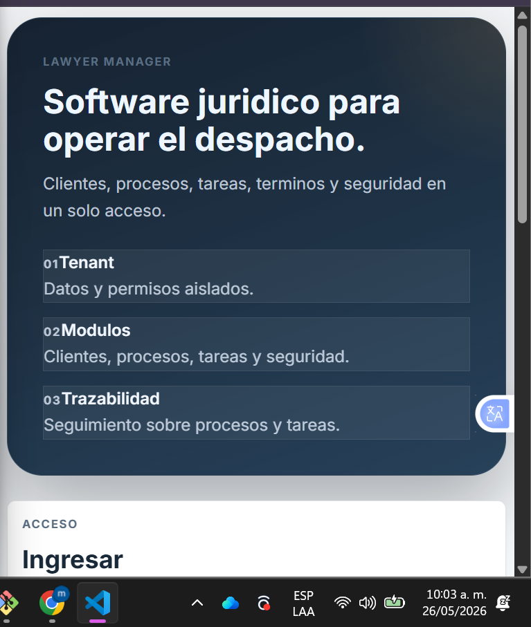
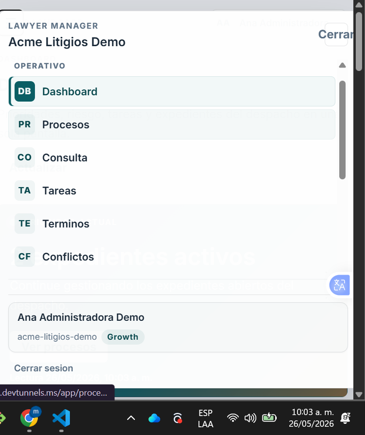
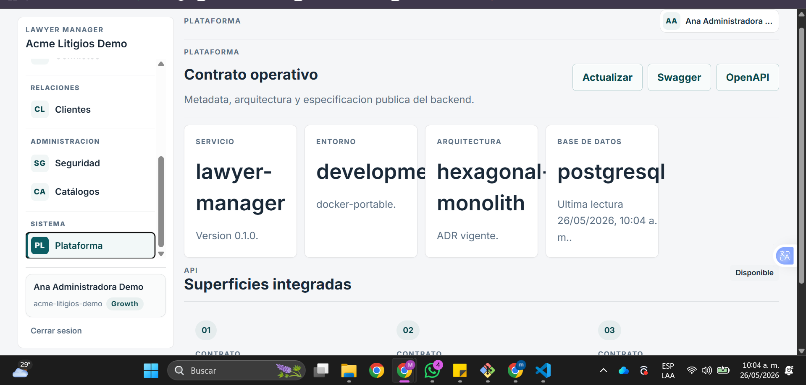
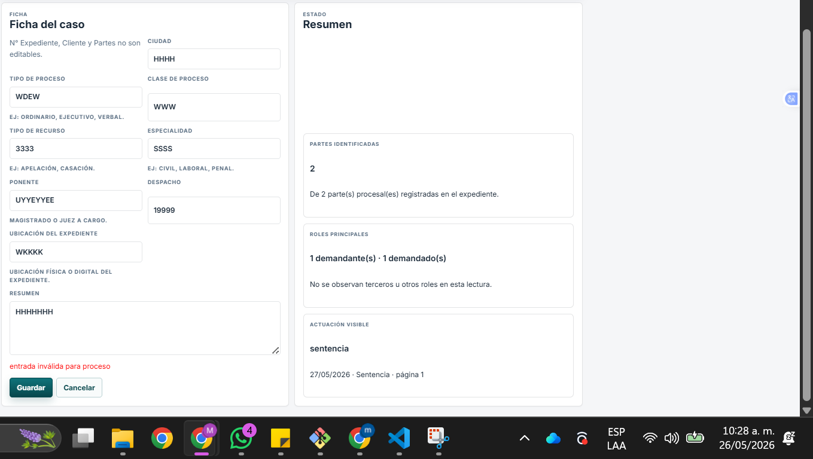
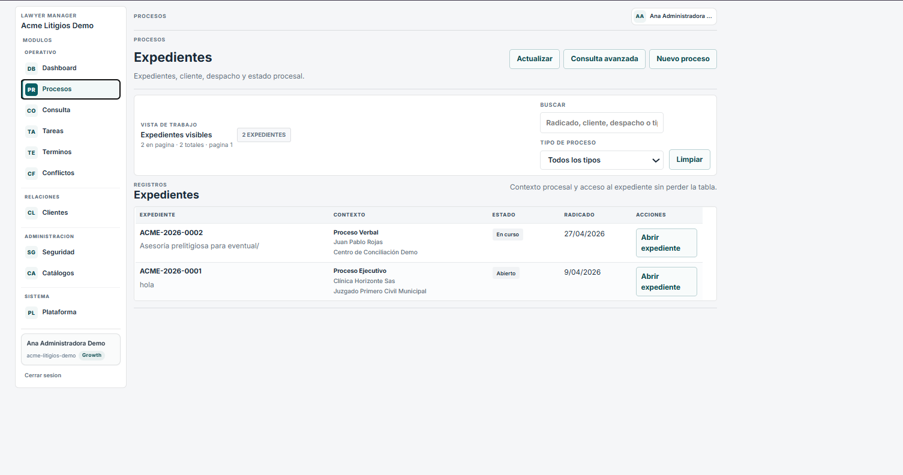
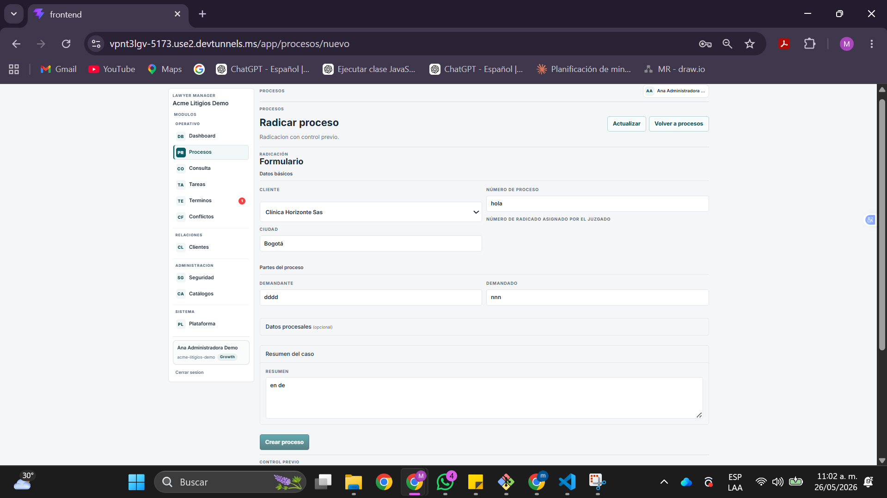
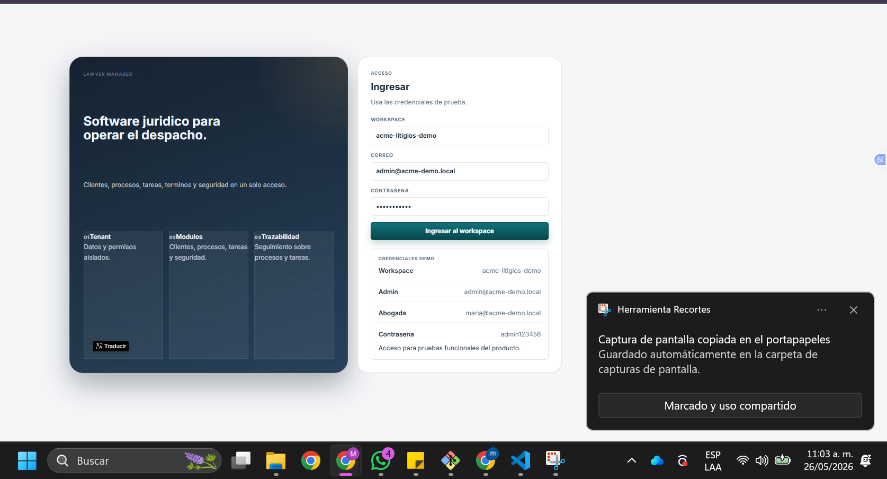

- Responsive Design (Diseño Responsivo)

## La página debe verse correctamente en:

- Computador
- Celular

Errores comunes:
- Texto muy grande o muy pequeño.
- Elementos cortados.
- letras fuera de los botones

---------------------------

## UX ( Experiencia de Usuario)

- navegacion un poco compleja o  poco entendida
<video width="600" controls>
  <source src="video.mp4" type="video/mp4">
</video>

-----------------

## Validación de Formularios

No valida campos.
- 

---------------
Otras cosas inconsistencias 

- Lista de expedientes funciona, pero confirma que no hay botón de eliminar en ningún registro, 
El usuario no puede borrar el expediente 

-----------

El campo "Número de proceso" acepta texto libre, el usuario escribió "hola" y se guardó.

-----------

app/terminos

cuando ingreso a terminos me saca de 

